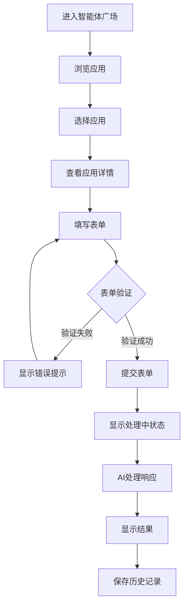
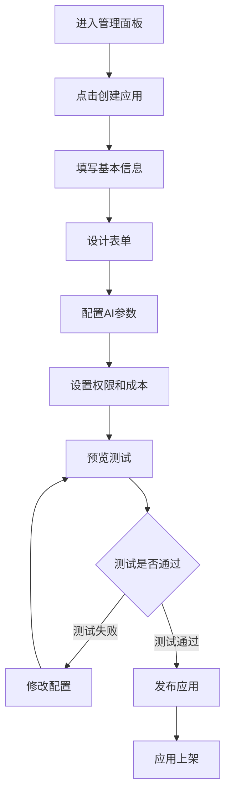

# OpenWebUI 智能体广场系统设计文档

## 📋 项目概述

### 项目名称

OpenWebUI 智能体广场 (Agent Marketplace)

### 项目目标

构建一个智能体应用平台，允许管理员创建和配置各种表单应用，用户可以通过填写表单与AI进行交互，实现定制化的AI服务体验。

### 核心特性

- 🏪 **智能体广场**：展示和管理多种智能体应用
- 📝 **表单应用系统**：支持自定义表单配置
- 🔧 **管理员配置**：灵活的应用创建和管理
- 👥 **用户交互**：直观的表单填写和AI对话体验
- 📊 **使用统计**：应用使用情况和性能监控

---

## 🎯 需求分析

### 功能需求

#### 1. 管理员功能

- **应用管理**

  - 创建新的智能体应用
  - 编辑现有应用配置
  - 启用/禁用应用
  - 删除应用
  - 应用分类管理

- **表单配置**

  - 支持多种字段类型（文本、下拉、开关、文件上传等）
  - 字段属性配置（必填、验证规则、默认值等）
  - 表单布局设计
  - 预览功能

- **权限控制**
  - 应用可见性设置
  - 用户组权限管理
  - 使用次数限制

#### 2. 用户功能

- **应用浏览**

  - 智能体广场首页
  - 应用分类浏览
  - 搜索和筛选
  - 应用详情查看

- **表单交互**

  - 填写表单数据
  - 文件上传
  - 表单验证提示
  - 提交处理

- **AI对话**
  - 基于表单数据的AI交互
  - 实时对话流
  - 结果展示
  - 历史记录

#### 3. 系统功能

- **模板系统**

  - 预制应用模板
  - 模板导入导出
  - 社区模板分享

- **统计分析**
  - 应用使用统计
  - 用户行为分析
  - 性能监控

### 基于截图的具体需求分析

从提供的"表单测试应用"截图中，我们可以识别出以下具体需求：

#### 表单字段类型

1. **文本输入框**

   - 支持字符长度限制（如：0/50）
   - 实时字符计数
   - 占位符文本

2. **下拉选择框**

   - 预设选项配置
   - 默认值设置
   - 动态选项加载

3. **开关控件**

   - 布尔值选择
   - 默认状态配置
   - 状态变化回调

4. **文件上传**
   - 文件格式限制（.png, .jpg等）
   - 文件大小限制（10MB）
   - 批量上传支持（最多10个文件）
   - 拖拽上传功能

#### 界面功能

- 表单验证和提示
- 消费信息显示（tokens/积分）
- 提交和收藏功能
- 响应式布局设计

---

## 🏗️ 系统架构设计

### 整体架构

```
┌─────────────────┐    ┌─────────────────┐    ┌─────────────────┐
│   前端界面      │    │   后端API       │    │   数据存储      │
│  (SvelteKit)    │    │  (FastAPI)      │    │  (PostgreSQL)   │
├─────────────────┤    ├─────────────────┤    ├─────────────────┤
│ • 智能体广场    │◄──►│ • 应用管理API   │◄──►│ • 应用配置表    │
│ • 表单渲染器    │    │ • 表单处理API   │    │ • 用户提交表    │
│ • 管理面板      │    │ • AI交互API     │    │ • 统计数据表    │
│ • 对话界面      │    │ • 统计分析API   │    │ • 文件存储      │
└─────────────────┘    └─────────────────┘    └─────────────────┘
```

### 技术栈选择

#### 前端技术

- **框架**：SvelteKit + TypeScript
- **UI组件**：TailwindCSS + 自定义组件库
- **状态管理**：Svelte Stores
- **表单处理**：自研表单引擎
- **文件上传**：支持拖拽的上传组件

#### 后端技术

- **API框架**：FastAPI + Python
- **数据库ORM**：SQLAlchemy
- **文件存储**：本地存储 + 对象存储支持
- **AI集成**：现有的OpenAI/Ollama集成
- **任务队列**：Redis + Celery（可选）

#### 数据存储

- **主数据库**：PostgreSQL
- **缓存**：Redis
- **文件存储**：本地文件系统 / AWS S3 / MinIO

---

## 💾 数据库设计

### 核心数据表

#### 1. 智能体应用表 (agent_apps)

```sql
CREATE TABLE agent_apps (
    id VARCHAR PRIMARY KEY,
    name VARCHAR(100) NOT NULL,                    -- 应用名称
    display_name VARCHAR(100) NOT NULL,            -- 显示名称
    description TEXT,                              -- 应用描述
    category_id VARCHAR,                           -- 分类ID
    icon_url VARCHAR,                              -- 应用图标
    banner_url VARCHAR,                            -- 横幅图片
    app_type VARCHAR DEFAULT 'form',               -- 应用类型：form, chat, tool
    status VARCHAR DEFAULT 'draft',                -- 状态：draft, active, inactive
    config JSON NOT NULL,                          -- 应用配置（表单定义、AI提示等）
    metadata JSON DEFAULT '{}',                    -- 元数据
    access_control JSON DEFAULT '{}',              -- 权限控制
    usage_limit INTEGER DEFAULT 0,                -- 使用次数限制(0=无限制)
    cost_per_use INTEGER DEFAULT 0,               -- 每次使用消耗积分
    created_by VARCHAR NOT NULL,                  -- 创建者ID
    created_at BIGINT DEFAULT extract(epoch from now()),
    updated_at BIGINT DEFAULT extract(epoch from now()),

    FOREIGN KEY (created_by) REFERENCES user(id),
    FOREIGN KEY (category_id) REFERENCES app_categories(id)
);
```

#### 2. 应用分类表 (app_categories)

```sql
CREATE TABLE app_categories (
    id VARCHAR PRIMARY KEY,
    name VARCHAR(50) NOT NULL,                     -- 分类名称
    display_name VARCHAR(50) NOT NULL,             -- 显示名称
    description TEXT,                              -- 分类描述
    icon VARCHAR,                                  -- 分类图标
    sort_order INTEGER DEFAULT 0,                 -- 排序顺序
    parent_id VARCHAR,                             -- 父分类ID
    is_active BOOLEAN DEFAULT true,
    created_at BIGINT DEFAULT extract(epoch from now()),

    FOREIGN KEY (parent_id) REFERENCES app_categories(id)
);
```

#### 3. 用户提交记录表 (app_submissions)

```sql
CREATE TABLE app_submissions (
    id VARCHAR PRIMARY KEY,
    app_id VARCHAR NOT NULL,                       -- 应用ID
    user_id VARCHAR NOT NULL,                      -- 用户ID
    session_id VARCHAR,                            -- 会话ID（用于关联对话）
    form_data JSON NOT NULL,                       -- 提交的表单数据
    files JSON DEFAULT '[]',                       -- 上传的文件信息
    ai_response TEXT,                              -- AI响应结果
    status VARCHAR DEFAULT 'pending',              -- 状态：pending, processing, completed, failed
    cost_consumed INTEGER DEFAULT 0,               -- 消耗的积分
    processing_time INTEGER,                       -- 处理时间(ms)
    error_message TEXT,                            -- 错误信息
    metadata JSON DEFAULT '{}',
    created_at BIGINT DEFAULT extract(epoch from now()),
    completed_at BIGINT,

    FOREIGN KEY (app_id) REFERENCES agent_apps(id),
    FOREIGN KEY (user_id) REFERENCES user(id)
);
```

#### 4. 应用使用统计表 (app_usage_stats)

```sql
CREATE TABLE app_usage_stats (
    id VARCHAR PRIMARY KEY,
    app_id VARCHAR NOT NULL,                       -- 应用ID
    date DATE NOT NULL,                            -- 统计日期
    total_uses INTEGER DEFAULT 0,                 -- 总使用次数
    unique_users INTEGER DEFAULT 0,               -- 独立用户数
    total_cost INTEGER DEFAULT 0,                 -- 总消耗积分
    avg_processing_time INTEGER DEFAULT 0,        -- 平均处理时间
    success_rate DECIMAL(5,2) DEFAULT 0,          -- 成功率
    error_count INTEGER DEFAULT 0,                -- 错误次数

    FOREIGN KEY (app_id) REFERENCES agent_apps(id),
    UNIQUE(app_id, date)
);
```

#### 5. 应用模板表 (app_templates)

```sql
CREATE TABLE app_templates (
    id VARCHAR PRIMARY KEY,
    name VARCHAR(100) NOT NULL,                    -- 模板名称
    display_name VARCHAR(100) NOT NULL,            -- 显示名称
    description TEXT,                              -- 模板描述
    category VARCHAR(50),                          -- 模板分类
    preview_image VARCHAR,                         -- 预览图片
    template_config JSON NOT NULL,                -- 模板配置
    is_public BOOLEAN DEFAULT false,               -- 是否公开
    download_count INTEGER DEFAULT 0,             -- 下载次数
    rating DECIMAL(3,2) DEFAULT 0,                -- 评分
    created_by VARCHAR NOT NULL,
    created_at BIGINT DEFAULT extract(epoch from now()),

    FOREIGN KEY (created_by) REFERENCES user(id)
);
```

---

## 📝 表单配置结构

### 表单配置JSON Schema

基于截图分析，表单配置应支持以下结构：

```json
{
	"form_config": {
		"title": "表单测试应用",
		"description": "这是一个演示表单应用",
		"fields": [
			{
				"id": "title",
				"type": "text",
				"label": "标题",
				"required": true,
				"placeholder": "请输入标题，不超过N个字",
				"validation": {
					"maxLength": 50,
					"pattern": null
				},
				"props": {
					"showCounter": true,
					"multiline": false
				}
			},
			{
				"id": "direction",
				"type": "select",
				"label": "方向",
				"required": true,
				"options": [
					{ "value": "仿感", "label": "仿感" },
					{ "value": "创意", "label": "创意" },
					{ "value": "分析", "label": "分析" }
				],
				"defaultValue": "仿感"
			},
			{
				"id": "enable_search",
				"type": "switch",
				"label": "允许联网搜索",
				"required": false,
				"defaultValue": true,
				"description": "启用后将允许AI进行网络搜索"
			},
			{
				"id": "reference_files",
				"type": "file",
				"label": "参考文件",
				"required": true,
				"validation": {
					"maxFiles": 10,
					"maxSize": "10MB",
					"allowedTypes": [".png", ".jpg", ".jpeg", ".pdf", ".docx"]
				},
				"props": {
					"allowDrag": true,
					"allowMultiple": true
				}
			}
		],
		"layout": {
			"type": "vertical",
			"spacing": "medium",
			"submitButton": {
				"text": "提交",
				"style": "primary"
			},
			"actions": [
				{
					"type": "favorite",
					"text": "收藏",
					"icon": "star"
				}
			]
		}
	},
	"ai_config": {
		"model": "gpt-4",
		"system_prompt": "你是一个专业的AI助手，请根据用户提供的表单信息进行分析和回答...",
		"temperature": 0.7,
		"max_tokens": 2000,
		"use_knowledge_base": true,
		"enable_web_search": "{{form.enable_search}}",
		"context_files": "{{form.reference_files}}"
	},
	"cost_config": {
		"base_cost": 100,
		"cost_per_token": 0.1,
		"cost_per_file": 10
	}
}
```

### 支持的字段类型

#### 1. 文本输入 (text)

```json
{
	"type": "text",
	"validation": {
		"minLength": 1,
		"maxLength": 1000,
		"pattern": "^[\\s\\S]*$"
	},
	"props": {
		"multiline": false,
		"rows": 3,
		"showCounter": true,
		"autoResize": true
	}
}
```

#### 2. 下拉选择 (select)

```json
{
	"type": "select",
	"options": [
		{ "value": "option1", "label": "选项1" },
		{ "value": "option2", "label": "选项2", "disabled": true }
	],
	"props": {
		"searchable": true,
		"clearable": true,
		"multiple": false
	}
}
```

#### 3. 开关控件 (switch)

```json
{
	"type": "switch",
	"defaultValue": false,
	"props": {
		"size": "default",
		"checkedText": "开启",
		"uncheckedText": "关闭"
	}
}
```

#### 4. 文件上传 (file)

```json
{
	"type": "file",
	"validation": {
		"maxFiles": 10,
		"maxSize": "10MB",
		"allowedTypes": [".png", ".jpg", ".jpeg", ".gif", ".pdf", ".docx", ".txt"]
	},
	"props": {
		"allowDrag": true,
		"allowMultiple": true,
		"showPreview": true,
		"uploadUrl": "/api/v1/files/upload"
	}
}
```

#### 5. 数字输入 (number)

```json
{
	"type": "number",
	"validation": {
		"min": 0,
		"max": 100,
		"step": 1
	},
	"props": {
		"showControls": true,
		"precision": 2
	}
}
```

#### 6. 日期选择 (date)

```json
{
	"type": "date",
	"validation": {
		"min": "2024-01-01",
		"max": "2024-12-31"
	},
	"props": {
		"format": "YYYY-MM-DD",
		"showTime": false
	}
}
```

#### 7. 多选框组 (checkbox)

```json
{
	"type": "checkbox",
	"options": [
		{ "value": "option1", "label": "选项1" },
		{ "value": "option2", "label": "选项2" }
	],
	"validation": {
		"minSelected": 1,
		"maxSelected": 3
	}
}
```

#### 8. 单选框组 (radio)

```json
{
	"type": "radio",
	"options": [
		{ "value": "option1", "label": "选项1" },
		{ "value": "option2", "label": "选项2" }
	],
	"props": {
		"layout": "horizontal"
	}
}
```

---

## 🖥️ 前端界面设计

### 页面结构

#### 1. 智能体广场首页

```
Header (导航栏)
├── Logo + 搜索框
├── 分类导航
└── 用户菜单

Main Content
├── Banner轮播图
├── 热门应用推荐
├── 分类应用展示
│   ├── 应用卡片网格
│   │   ├── 应用图标
│   │   ├── 应用名称
│   │   ├── 应用描述
│   │   ├── 使用次数
│   │   └── 立即使用按钮
│   └── 分页/加载更多
└── Footer
```

#### 2. 应用详情页

```
应用Header
├── 应用图标 + 名称
├── 创建者信息
├── 使用统计
└── 操作按钮（使用/收藏/分享）

应用描述
├── 详细介绍
├── 功能特点
└── 使用说明

表单区域
├── 动态渲染的表单
├── 实时验证提示
└── 提交按钮

AI对话区域 (提交后显示)
├── 对话历史
├── 实时响应
└── 结果展示
```

#### 3. 管理面板

```
侧边栏导航
├── 应用管理
├── 分类管理
├── 模板管理
├── 统计分析
└── 系统设置

主要内容区域
├── 应用列表/编辑
├── 表单设计器
├── 预览面板
└── 配置面板
```

### 表单设计器界面

#### 组件面板

```
基础组件
├── 📝 文本输入
├── 📋 下拉选择
├── 🔘 单选框
├── ☑️ 多选框
├── 🎚️ 开关
├── 🔢 数字输入
├── 📅 日期选择
└── 📁 文件上传

布局组件
├── 📦 容器
├── 🏗️ 分组
├── 📊 分栏
└── 📏 分隔符

高级组件
├── 🔍 搜索框
├── 📍 评分
├── 🏷️ 标签
└── 📝 富文本
```

#### 属性配置面板

```
基础属性
├── 字段ID
├── 字段标签
├── 占位符
├── 默认值
└── 帮助文本

验证规则
├── 是否必填
├── 长度限制
├── 格式验证
└── 自定义规则

样式配置
├── 字段宽度
├── 对齐方式
├── 显示样式
└── 条件显示
```

### 关键Svelte组件设计

#### 1. 表单渲染器组件

```svelte
<!-- FormRenderer.svelte -->
<script>
	export let config;
	export let data = {};
	export let errors = {};
	export let readonly = false;

	import TextInput from './fields/TextInput.svelte';
	import SelectInput from './fields/SelectInput.svelte';
	import FileUpload from './fields/FileUpload.svelte';
	import SwitchInput from './fields/SwitchInput.svelte';
	// ... 其他字段组件

	const fieldComponents = {
		text: TextInput,
		select: SelectInput,
		file: FileUpload,
		switch: SwitchInput
		// ... 更多组件映射
	};
</script>

<form class="agent-form">
	{#each config.fields as field}
		<div class="form-field">
			<svelte:component
				this={fieldComponents[field.type]}
				{field}
				bind:value={data[field.id]}
				error={errors[field.id]}
				{readonly}
			/>
		</div>
	{/each}

	<div class="form-actions">
		<slot name="actions" />
	</div>
</form>
```

#### 2. 应用卡片组件

```svelte
<!-- AppCard.svelte -->
<script>
	export let app;
	export let size = 'medium'; // small, medium, large

	import { createEventDispatcher } from 'svelte';
	const dispatch = createEventDispatcher();

	function handleUse() {
		dispatch('use', { app });
	}

	function handleFavorite() {
		dispatch('favorite', { app });
	}
</script>

<div class="app-card app-card--{size}">
	<div class="app-card__header">
		{#if app.icon_url}
			
		{/if}
		<div class="app-card__meta">
			<h3 class="app-card__title">{app.display_name}</h3>
			<p class="app-card__author">by {app.created_by}</p>
		</div>
	</div>

	<div class="app-card__content">
		<p class="app-card__description">{app.description}</p>
		<div class="app-card__stats">
			<span class="stat">
				👥 {app.usage_count || 0} 次使用
			</span>
			<span class="stat">
				💰 {app.cost_per_use || 0} 积分
			</span>
		</div>
	</div>

	<div class="app-card__actions">
		<button class="btn btn--primary" on:click={handleUse}> 立即使用 </button>
		<button class="btn btn--ghost" on:click={handleFavorite}> ⭐ </button>
	</div>
</div>
```

---

## 🔧 后端API设计

### API路由结构

```
/api/v1/agents/
├── GET    /                    # 获取应用列表
├── POST   /                    # 创建应用
├── GET    /{app_id}           # 获取应用详情
├── PUT    /{app_id}           # 更新应用
├── DELETE /{app_id}           # 删除应用
├── POST   /{app_id}/submit    # 提交表单
├── GET    /{app_id}/stats     # 获取应用统计
└── POST   /{app_id}/favorite  # 收藏应用

/api/v1/agents/categories/
├── GET    /                    # 获取分类列表
├── POST   /                    # 创建分类
├── PUT    /{category_id}      # 更新分类
└── DELETE /{category_id}      # 删除分类

/api/v1/agents/templates/
├── GET    /                    # 获取模板列表
├── POST   /                    # 创建模板
├── GET    /{template_id}      # 获取模板详情
└── POST   /{template_id}/use  # 使用模板创建应用

/api/v1/agents/submissions/
├── GET    /                    # 获取提交历史
├── GET    /{submission_id}    # 获取提交详情
└── DELETE /{submission_id}    # 删除提交记录
```

### 核心API实现

#### 1. 应用管理API

```python
# /backend/open_webui/routers/agents.py

from fastapi import APIRouter, Depends, HTTPException, UploadFile, File
from typing import List, Optional
from open_webui.models.agents import AgentApps, AppSubmissions
from open_webui.utils.auth import get_verified_user, get_admin_user

router = APIRouter()

@router.get("/", response_model=List[AgentAppResponse])
async def get_agent_apps(
    category: Optional[str] = None,
    search: Optional[str] = None,
    page: int = 1,
    limit: int = 20,
    user=Depends(get_verified_user)
):
    """获取智能体应用列表"""
    try:
        apps = AgentApps.get_apps(
            category=category,
            search=search,
            page=page,
            limit=limit,
            user_id=user.id if user.role != "admin" else None
        )
        return apps
    except Exception as e:
        raise HTTPException(status_code=500, detail=str(e))

@router.post("/", response_model=AgentAppResponse)
async def create_agent_app(
    form_data: AgentAppCreate,
    user=Depends(get_admin_user)
):
    """创建智能体应用"""
    try:
        app = AgentApps.create_app(
            name=form_data.name,
            display_name=form_data.display_name,
            description=form_data.description,
            config=form_data.config,
            created_by=user.id
        )
        return app
    except Exception as e:
        raise HTTPException(status_code=400, detail=str(e))

@router.post("/{app_id}/submit")
async def submit_app_form(
    app_id: str,
    form_data: dict,
    files: Optional[List[UploadFile]] = File(None),
    user=Depends(get_verified_user)
):
    """提交应用表单"""
    try:
        # 获取应用配置
        app = AgentApps.get_app_by_id(app_id)
        if not app:
            raise HTTPException(status_code=404, detail="Application not found")

        # 验证表单数据
        validation_result = validate_form_data(app.config, form_data)
        if not validation_result.is_valid:
            raise HTTPException(status_code=400, detail=validation_result.errors)

        # 处理文件上传
        file_urls = []
        if files:
            file_urls = await upload_files(files, user.id)

        # 创建提交记录
        submission = AppSubmissions.create_submission(
            app_id=app_id,
            user_id=user.id,
            form_data=form_data,
            files=file_urls
        )

        # 异步处理AI响应
        await process_ai_response.delay(submission.id)

        return {
            "submission_id": submission.id,
            "status": "processing",
            "message": "表单已提交，正在处理中..."
        }

    except Exception as e:
        raise HTTPException(status_code=500, detail=str(e))
```

#### 2. 表单验证系统

```python
# /backend/open_webui/utils/form_validator.py

from typing import Dict, List, Any
from pydantic import BaseModel, ValidationError
import re

class ValidationResult(BaseModel):
    is_valid: bool
    errors: Dict[str, List[str]] = {}

class FormValidator:
    """表单验证器"""

    @staticmethod
    def validate_form_data(config: dict, data: dict) -> ValidationResult:
        """验证表单数据"""
        errors = {}

        for field in config.get('fields', []):
            field_id = field['id']
            field_type = field['type']
            value = data.get(field_id)

            # 检查必填字段
            if field.get('required', False) and not value:
                errors.setdefault(field_id, []).append('此字段为必填项')
                continue

            # 如果不是必填且值为空，跳过验证
            if not value and not field.get('required', False):
                continue

            # 根据字段类型验证
            field_errors = FormValidator._validate_field(field, value)
            if field_errors:
                errors[field_id] = field_errors

        return ValidationResult(
            is_valid=len(errors) == 0,
            errors=errors
        )

    @staticmethod
    def _validate_field(field: dict, value: Any) -> List[str]:
        """验证单个字段"""
        errors = []
        field_type = field['type']
        validation = field.get('validation', {})

        if field_type == 'text':
            if isinstance(value, str):
                # 长度验证
                if 'minLength' in validation and len(value) < validation['minLength']:
                    errors.append(f'最少需要{validation["minLength"]}个字符')
                if 'maxLength' in validation and len(value) > validation['maxLength']:
                    errors.append(f'最多允许{validation["maxLength"]}个字符')

                # 正则验证
                if 'pattern' in validation and validation['pattern']:
                    if not re.match(validation['pattern'], value):
                        errors.append('格式不符合要求')
            else:
                errors.append('必须是文本类型')

        elif field_type == 'select':
            options = [opt['value'] for opt in field.get('options', [])]
            if value not in options:
                errors.append('请选择有效的选项')

        elif field_type == 'file':
            if isinstance(value, list):
                max_files = validation.get('maxFiles', 1)
                if len(value) > max_files:
                    errors.append(f'最多只能上传{max_files}个文件')

                allowed_types = validation.get('allowedTypes', [])
                max_size = validation.get('maxSize', '10MB')

                for file_info in value:
                    # 文件类型验证
                    if allowed_types:
                        file_ext = '.' + file_info.get('name', '').split('.')[-1].lower()
                        if file_ext not in allowed_types:
                            errors.append(f'不支持的文件格式: {file_ext}')

                    # 文件大小验证
                    file_size = file_info.get('size', 0)
                    max_size_bytes = FormValidator._parse_size(max_size)
                    if file_size > max_size_bytes:
                        errors.append(f'文件大小超过限制: {max_size}')

        return errors

    @staticmethod
    def _parse_size(size_str: str) -> int:
        """解析文件大小字符串为字节数"""
        size_str = size_str.upper()
        if size_str.endswith('KB'):
            return int(size_str[:-2]) * 1024
        elif size_str.endswith('MB'):
            return int(size_str[:-2]) * 1024 * 1024
        elif size_str.endswith('GB'):
            return int(size_str[:-2]) * 1024 * 1024 * 1024
        else:
            return int(size_str)
```

#### 3. AI响应处理

```python
# /backend/open_webui/utils/ai_processor.py

import asyncio
from typing import Dict, Any
from open_webui.models.agents import AppSubmissions
from open_webui.utils.chat import generate_chat_completion

class AIProcessor:
    """AI响应处理器"""

    @staticmethod
    async def process_submission(submission_id: str):
        """处理应用提交"""
        try:
            submission = AppSubmissions.get_submission_by_id(submission_id)
            if not submission:
                return

            # 更新状态为处理中
            AppSubmissions.update_submission_status(
                submission_id,
                status='processing'
            )

            # 获取应用配置
            app = AgentApps.get_app_by_id(submission.app_id)
            ai_config = app.config.get('ai_config', {})

            # 构建AI提示
            prompt = AIProcessor._build_prompt(
                ai_config,
                submission.form_data,
                submission.files
            )

            # 调用AI生成响应
            response = await generate_chat_completion({
                'model': ai_config.get('model', 'gpt-3.5-turbo'),
                'messages': [
                    {
                        'role': 'system',
                        'content': ai_config.get('system_prompt', '')
                    },
                    {
                        'role': 'user',
                        'content': prompt
                    }
                ],
                'temperature': ai_config.get('temperature', 0.7),
                'max_tokens': ai_config.get('max_tokens', 2000)
            })

            # 更新提交记录
            AppSubmissions.update_submission_response(
                submission_id,
                ai_response=response['content'],
                status='completed',
                cost_consumed=response.get('cost', 0)
            )

        except Exception as e:
            # 记录错误
            AppSubmissions.update_submission_status(
                submission_id,
                status='failed',
                error_message=str(e)
            )

    @staticmethod
    def _build_prompt(ai_config: dict, form_data: dict, files: list) -> str:
        """构建AI提示"""
        prompt_template = ai_config.get('prompt_template', '')

        # 替换模板变量
        for key, value in form_data.items():
            prompt_template = prompt_template.replace(f'{{{{form.{key}}}}}', str(value))

        # 添加文件信息
        if files:
            file_info = '\n'.join([f"文件: {f['name']}" for f in files])
            prompt_template += f'\n\n附件信息:\n{file_info}'

        return prompt_template
```

---

## 🎨 用户交互流程

### 1. 用户使用应用流程



### 2. 管理员创建应用流程



---

## 📊 统计和监控

### 关键指标

#### 应用级别统计

- 使用次数和趋势
- 独立用户数
- 成功率和错误率
- 平均响应时间
- 积分消耗统计

#### 用户级别统计

- 最常使用的应用
- 总使用次数
- 积分消耗记录
- 收藏应用列表

#### 系统级别统计

- 总应用数量
- 总用户数量
- 整体使用趋势
- 资源使用情况

### 监控面板设计

```
📊 统计概览
├── 📈 使用趋势图表
├── 🏆 热门应用排行
├── 👥 活跃用户统计
└── 💰 收入统计

📱 应用详细统计
├── 📊 使用量趋势
├── ⏱️ 响应时间分析
├── ❌ 错误率统计
└── 💬 用户反馈

👤 用户行为分析
├── 🔍 用户路径分析
├── ⭐ 偏好应用分析
├── 💳 消费行为分析
└── 🔄 留存率分析
```

---

## 🚀 实施计划

### 第一阶段：基础框架 (2-3周)

- [ ] 数据库设计和迁移
- [ ] 基础API路由实现
- [ ] 前端页面框架搭建
- [ ] 用户权限系统集成

### 第二阶段：核心功能 (3-4周)

- [ ] 表单设计器实现
- [ ] 表单渲染引擎
- [ ] AI响应处理系统
- [ ] 文件上传和管理

### 第三阶段：高级功能 (2-3周)

- [ ] 应用模板系统
- [ ] 统计分析功能
- [ ] 用户交互优化
- [ ] 性能优化

### 第四阶段：完善和测试 (1-2周)

- [ ] 系统测试和bug修复
- [ ] 性能测试和优化
- [ ] 用户体验改进
- [ ] 文档编写

### 第五阶段：上线部署 (1周)

- [ ] 生产环境部署
- [ ] 数据迁移
- [ ] 用户培训
- [ ] 监控和维护

---

## 🛡️ 安全考虑

### 数据安全

- 用户提交数据加密存储
- 文件上传安全检查
- 敏感信息脱敏处理
- 定期数据备份

### 访问控制

- 基于角色的权限管理
- API访问频率限制
- 应用使用权限控制
- 敏感操作日志记录

### 内容安全

- 用户输入内容过滤
- AI响应内容审核
- 恶意应用检测
- 垃圾信息防护

---

## 📚 技术文档

### 开发规范

- 代码规范和评审流程
- API接口文档规范
- 数据库设计规范
- 前端组件开发规范

### 部署指南

- 环境配置要求
- 数据库初始化脚本
- 服务部署步骤
- 性能调优建议

### 维护手册

- 常见问题解决
- 系统监控指标
- 数据备份恢复
- 版本升级指南

---

## 📝 总结

智能体广场系统将为OpenWebUI带来强大的扩展能力，允许管理员创建各种定制化的AI应用，用户可以通过简单的表单交互获得专业的AI服务。

### 核心价值

1. **lowcode平台**: 通过可视化表单设计器，降低AI应用开发门槛
2. **模块化架构**: 支持插件式扩展，适应不同业务场景
3. **用户友好**: 直观的界面和流畅的交互体验
4. **数据驱动**: 完整的统计分析系统，支持运营决策

### 预期效果

- 提升用户粘性和活跃度
- 创建AI应用生态系统
- 降低定制开发成本
- 增强系统商业价值

通过此系统的实施，OpenWebUI将从一个AI聊天工具升级为一个完整的AI应用平台，为用户提供更丰富、更专业的AI服务体验。
